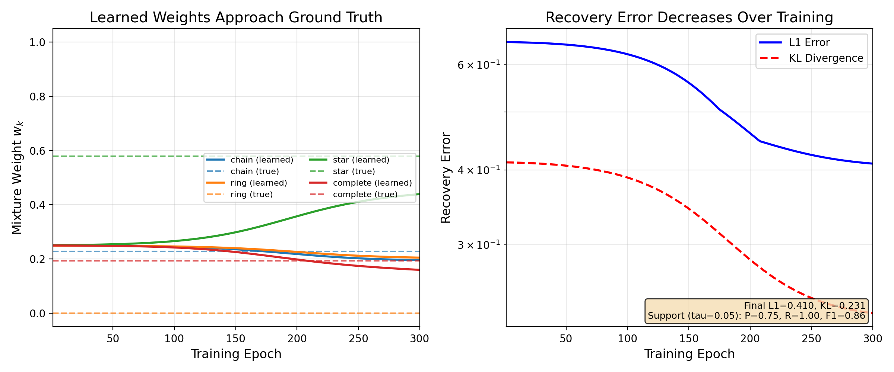
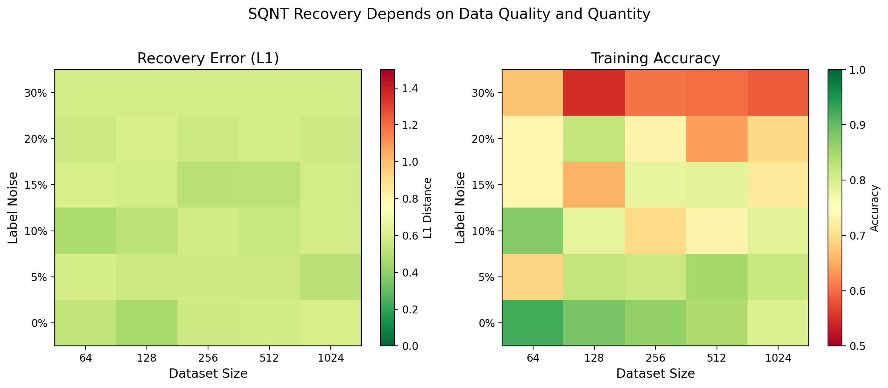
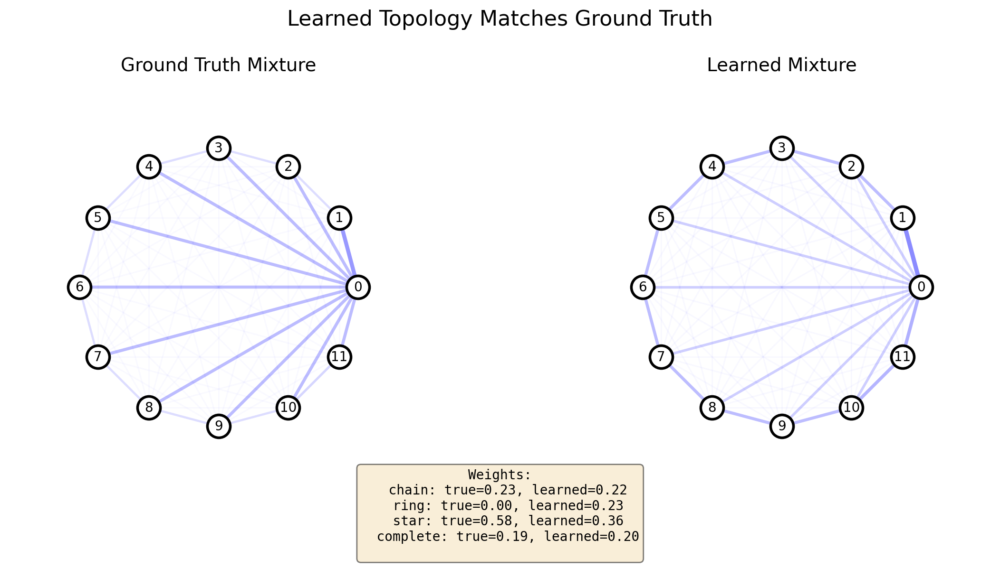
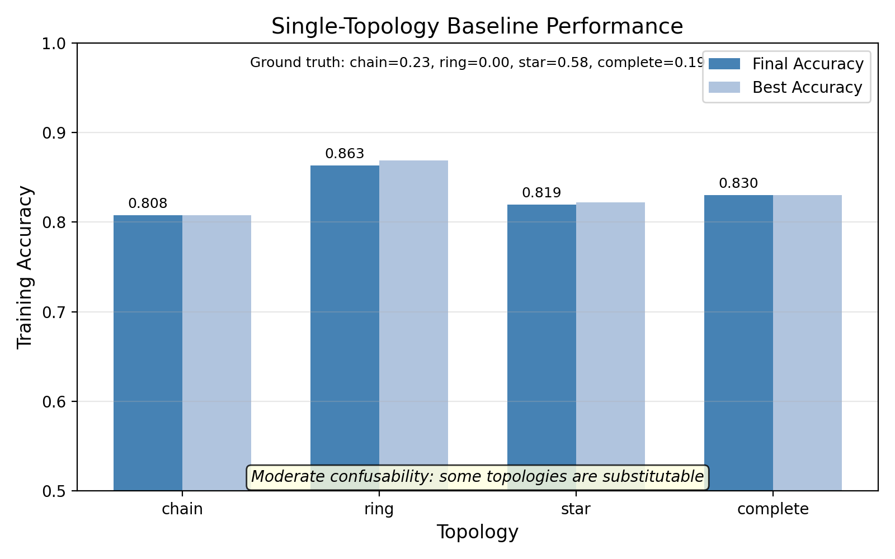

# Hardware Demonstration of Superpositional Quantum Network Topologies (Adaptive Quantum Networks)

*A minimal, runnable bridge artifact connecting the theory line from "Superpositional Quantum Network Topologies" and "Backpropagation in Adaptive Quantum Networks" (Int. Journal of Theoretical Physics).*

<br>

[](https://www.python.org/downloads/)
[](https://opensource.org/licenses/MIT)
[](https://scholar.google.com/citations?user=tvwpCcgAAAAJ)
[](https://huggingface.co/Cohaerence)

[](https://x.com/coherence)
[](https://www.christopheraltman.com)
[](https://www.linkedin.com/in/Altman)
<!-- [](https://doi.org/10.5281/zenodo.XXXXXXX) -->

## Motivation

Classical neural networks treat connectivity as fixed architecture. In contrast, **Superpositional Quantum Network Topologies (SQNT)** allow network structure itself to exist in superposition—enabling the network to learn *which topology* is optimal for a given task. This repository provides a minimal, reproducible demonstration of:

1. **Topology spatialization**: projecting operator-space weights onto graph structure
2. **Superposed topologies**: mixing multiple graph masks via learned coefficients
3. **Gradient-based topology learning**: jointly optimizing network parameters *and* topology mixture weights
4. **Ground-truth recovery**: measuring how well planted topology mixtures can be identified from data
5. **Identifiability diagnostics**: quantifying topology confusability and support recovery

## Terminology

- **SQNT** – *Superpositional Quantum Network Topologies*
- **AQN** – *Adaptive Quantum Networks*

## Lineage

**Relation to Prior Work.** This repository builds directly on our earlier formulation of **Superposed Quantum Network Topologies (SQNT)** and learning dynamics on **Adaptive Quantum Networks (AQN)** (Altman, Pykacz & Zapatrin 2004; Altman & Zapatrin 2010). The methodological shift here is deliberate: we treat topology as **latent but fixed** and ask when it is **identifiable from observable behavior** (and when it is not). This enables controlled diagnostics—recovery error, thresholded support recovery, and single-topology baselines—that make **topology confusability** explicit even when predictive accuracy is high. In subsequent extensions, the adaptive/topology-backpropagation framework is reintroduced as a **constructive mechanism**: not merely to fit behavior, but to **break degeneracy** by coupling learning to additional observables, priors, and hardware constraints.

- We separate **inference** (identifiability under fixed structure) from **control** (adaptive topology learning).
- Adaptive topology learning is treated as a response when static recovery is **ill-posed** under the chosen observable.

- [**Superpositional Quantum Network Topologies** (IJTP 2004)](#ref-sqnt-2004)
- [**Backpropagation in Adaptive Quantum Networks** (IJTP 2010)](#ref-aqn-2010)
- [**Accelerated Training Convergence in Superposed Quantum Networks** (NATO Advanced Study Institute, 2007)](#ref-nato-2007)

---

## Mathematical Model

### Topology Masks

Given $n$ nodes, we define graph topologies via adjacency-derived masks $M_k \in \mathbb{R}^{n \times n}$:

| Topology | Description |
|----------|-------------|
| **Chain** | Linear path: node $i$ connects to $i \pm 1$ |
| **Ring** | Chain with wraparound: adds edge $(0, n-1)$ |
| **Star** | Hub-and-spoke: node 0 connects to all others |
| **Complete** | Fully connected: all pairs connected |

Each mask is optionally row-normalized and includes self-loops.

### Operator-Space Spatialization

The core SQNT operation spatializes a weight matrix $W$ onto topology $M$:

$$W_{\text{eff}} = W \odot M$$

where $\odot$ denotes element-wise (Hadamard) product. This restricts information flow to edges present in the topology.

### Learned Topology Mixture

For $K$ topologies with masks $\{M_1, \ldots, M_K\}$, we learn mixture weights via softmax over logits $\mathbf{z} \in \mathbb{R}^K$:

$$w_k = \frac{\exp(z_k)}{\sum_{j=1}^K \exp(z_j)}, \quad M(\mathbf{z}) = \sum_{k=1}^K w_k M_k$$

The effective operator becomes:

$$W_{\text{eff}}(\mathbf{z}) = W \odot M(\mathbf{z})$$

### Gradient Derivation

For binary cross-entropy loss $\mathcal{L}$, we derive gradients for joint optimization:

1. **Weight gradient** (standard): $\frac{\partial \mathcal{L}}{\partial W} = \frac{\partial \mathcal{L}}{\partial W_{\text{eff}}} \odot M$

2. **Mask gradient**: Since $W_{\text{eff},ij} = W_{ij} \cdot M_{ij}$:
   $$\frac{\partial \mathcal{L}}{\partial M_{ij}} = \frac{\partial \mathcal{L}}{\partial W_{\text{eff},ij}} \cdot W_{ij}$$

3. **Mixture weight gradient**: From $M = \sum_k w_k M_k$:
   $$\frac{\partial \mathcal{L}}{\partial w_k} = \sum_{ij} \frac{\partial \mathcal{L}}{\partial M_{ij}} \cdot (M_k)_{ij}$$

4. **Logit gradient** (softmax Jacobian):
   $$\frac{\partial \mathcal{L}}{\partial z_\ell} = \sum_k \frac{\partial \mathcal{L}}{\partial w_k} \cdot w_k (\delta_{k\ell} - w_\ell)$$

All gradients are computed analytically in NumPy—no autograd required.

---

## Results

### Figure 1: Mixture Recovery Convergence



**Left**: Learned mixture weights $\hat{w}_k(t)$ approach ground-truth weights $w^*_k$ (dashed lines) during training. The degree of convergence depends on topology confusability and data quality.

**Right**: Recovery error (L1 distance and KL divergence) decreases over training epochs. Support metrics (precision, recall, F1) quantify whether the correct topologies are identified.

### Figure 2: Identifiability Regime Map



This figure maps identifiability regimes across data conditions:

- **Left panel (Recovery Error)**: L1 distance between learned and true mixture weights. Lower values (green) indicate better identifiability; higher values (red) indicate topology confusability.
- **Right panel (Training Accuracy)**: Classification performance. High accuracy is achievable across most conditions.

**Key insight**: High accuracy can coexist with high L1 error due to topology confusability—the model learns *some* effective topology but not necessarily the *true* one. Low L1 combined with high accuracy indicates empirical identifiability under the current observable.

### Figure 3: Learned Graph Structure



Visualization of the learned mixture mask compared to ground truth. Nodes are arranged on a circle; edge opacity reflects mixture weights. The figure title adapts based on actual recovery quality (L1 error), and support metrics are annotated.

### Figure 4: Topology Confusion Baselines



Single-topology baseline accuracies reveal *topology confusability*: when multiple topologies achieve similar accuracy, they may be substitutable under the observable, making mixture recovery harder.

### Key Findings

- **Behavioral learning succeeds**: The model achieves good classification accuracy across topology settings; learned mixture weights converge to near-uniform (chain 0.26, ring 0.26, star 0.29, complete 0.20)
- **Topology dominance appears in this regime**: The complete-graph topology remains best (0.8652), while learned mixture (0.8125) ≈ random mixture (0.8145). The learned weights converge toward near-uniform values, suggesting the task is topology-dominated rather than mixture-benefiting under this data regime.
- **Mixture identifiability is measurable**: Recovery depends on data quality, noise level, and topology confusability
- **High accuracy can coexist with poor mixture recovery**: Topologies that are mutually substitutable under the loss function may lead to spurious weight assignments
- **Support recovery metrics** (precision, recall, F1) provide a more nuanced view than L1 error alone
- **All results are deterministic and reproducible** (seed=0)

### Identifiability vs. Accuracy

An important insight from this demonstration: **high classification accuracy does not guarantee correct mixture recovery**. If two topologies produce similar loss landscapes (high confusability), the optimizer may distribute weight between them arbitrarily while still achieving good behavioral performance. The identifiability controls below help diagnose and mitigate this.

---

## Quick Start

### One-Command Setup

```bash
python3 -m venv .venv && source .venv/bin/activate && pip install -e . && python scripts/run_all.py
```

### Step-by-Step

```bash
# Create virtual environment
python3 -m venv .venv
source .venv/bin/activate

# Install package
pip install -e .

# Run all experiments and generate figures
python scripts/run_all.py

# Or run specific figure generation
python scripts/make_figures_recovery.py

# Run tests
pip install pytest
pytest -v
```

### Module Invocation

```bash
python -m sqnt_hardware_demo.train_demo
```

---

## Reproducibility

All experiments use fixed random seeds for full reproducibility:

| Parameter | Value |
|-----------|-------|
| Random seed | 0 |
| Nodes (n) | 12 |
| Batch size | 1024 |
| Epochs | 300 |
| Learning rate (params) | 0.2 |
| Learning rate (mixture) | 0.15 |

Generated figures are deterministic—running `scripts/run_all.py` produces identical outputs.

---

## Identifiability Controls

The following parameters control sparse priors and identifiability diagnostics in `train_mixture_recovery()`:

| Parameter | Default | Description |
|-----------|---------|-------------|
| `--lambda_dirichlet` | 0.0 | Dirichlet MAP prior strength. Encourages sparse mixtures when > 0. |
| `--alpha_dirichlet` | 0.3 | Dirichlet concentration. Values < 1 push small weights toward 0. |
| `--lambda_entropy` | 0.0 | Entropy penalty. Positive values encourage uniform weights; negative encourages concentration. |
| `--tau_support` | 0.05 | Support threshold for precision/recall/F1 metrics. |

**Example with sparse prior:**

```python
from sqnt_hardware_demo.experiments import train_mixture_recovery

history = train_mixture_recovery(
    X, y, w_true,
    topology_names=["chain", "ring", "star", "complete"],
    n=12,
    epochs=300,
    lambda_dirichlet=0.1,   # Enable sparse Dirichlet prior
    alpha_dirichlet=0.3,     # Sparse concentration
)
```

**Support recovery metrics** are computed with threshold `tau`:
- **Precision**: Fraction of learned support that is correct
- **Recall**: Fraction of true support that was found
- **F1**: Harmonic mean of precision and recall

These metrics are reported in console output and saved to `results/identifiability_metrics.json`.

---

## Phase III: Compilation & Simulation

Phase III adds compilation-aware constraints and quantum simulation backends. All features are **opt-in** and defaults remain unchanged.

### Compilation Penalty

The compilation penalty encourages topologies with lower routing/SWAP overhead on a target device:

```python
from sqnt_hardware_demo.compilation import load_device_graph
from sqnt_hardware_demo.experiments import train_mixture_recovery

device_graph = load_device_graph("device_graphs/line_n12.json")

history = train_mixture_recovery(
    X, y, w_true,
    topology_names=["chain", "ring", "star", "complete"],
    n=12,
    epochs=300,
    enable_compile_constraints=True,
    device_graph=device_graph,
    lambda_compile=0.1,
)
```

### Device Graph JSON Format

Device graphs are stored in `device_graphs/` with this schema:

```json
{
  "name": "line_n12",
  "nodes": [0, 1, 2, ...],
  "edges": [[0, 1], [1, 2], ...],
  "metadata": {"connectivity": "linear", "native_gate_set": "cx,rz"}
}
```

### CLI Flags (run_all.py)

| Flag | Default | Description |
|------|---------|-------------|
| `--enable-compile-constraints` | OFF | Enable compilation penalty |
| `--device-graph PATH` | None | Path to device graph JSON |
| `--lambda-compile FLOAT` | 0.0 | Compilation penalty strength |
| `--compile-target {none,qiskit,pennylane,cirq}` | none | Circuit compilation backend |
| `--simulate-with {none,qiskit,pennylane,cirq}` | none | Simulation backend |
| `--shots INT` | 1024 | Shots for simulation |

**Example with compilation constraints:**

```bash
python scripts/run_all.py \
    --enable-compile-constraints \
    --device-graph device_graphs/line_n12.json \
    --lambda-compile 0.1
```

---

## Project Structure

```
sqnt-hardware-demo/
├── src/sqnt_hardware_demo/
│   ├── __init__.py           # Package exports
│   ├── graphs.py             # Topology mask generation
│   ├── sqnt_layer.py         # SQNT layer implementation
│   ├── train_demo.py         # Alpha-sweep training
│   ├── mixture.py            # Learned topology mixture
│   ├── experiments.py        # Ground-truth recovery experiments
│   ├── mlp.py                # Multi-layer SQNT network
│   ├── identifiability.py    # Support metrics and diagnostics
│   ├── compilation.py        # Device graph + routing penalty (Phase III)
│   ├── circuit_targets.py    # Qiskit/PennyLane/Cirq builders (Phase III)
│   └── sim_backends.py       # Simulation backends (Phase III)
├── scripts/
│   ├── make_figures_recovery.py  # Generate canonical figures
│   ├── run_all.py               # Full demonstration script
│   ├── download_mnist.py        # MNIST data loader
│   └── download_cifar10.py      # CIFAR-10 data loader
├── tests/
│   ├── test_sqnt_hardware_demo.py  # Core tests
│   ├── test_mixture.py          # Mixture and recovery tests
│   └── test_phase3_compilation_simulation.py  # Phase III tests
├── device_graphs/            # Device connectivity graphs (Phase III)
│   ├── line_n12.json
│   ├── grid_4x4.json
│   └── heavy_hex_toy.json
├── noise_models/             # Noise model specs (Phase III)
│   ├── none.json
│   ├── depolarizing.json
│   └── dephasing.json
├── figures/
│   ├── sqnt_mixture_recovery_convergence.png
│   ├── sqnt_recovery_phase_diagram.png
│   ├── sqnt_learned_graph_overlay.png
│   └── sqnt_topology_confusion_baselines.png
├── results/
│   └── identifiability_metrics.json
└── docs/
    ├── CLAUDE_UPGRADE_REPORT.md
    ├── CLAUDE_IDENTIFIABILITY_UPGRADE_REPORT.md
    └── CLAUDE_PHASE3_COMPILATION_SIMULATION_REPORT.md
```

---

## Versioned Features

### v2.1
- [x] Graph topology masks (chain, ring, star, complete)
- [x] Operator-space spatialization
- [x] Fixed-alpha topology mixing
- [x] Learned topology mixture with gradient descent
- [x] **Ground-truth mixture recovery experiments**
- [x] **Multi-layer network with per-layer topologies**
- [x] **Topology regularization** (sparsity, entropy, Dirichlet MAP)
- [x] **Phase diagram for identifiability**
- [x] **Learned graph visualization**
- [x] **Identifiability diagnostics** (support precision/recall/F1)
- [x] **Topology confusion baselines**
- [x] **Hardware-aware topology constraints** (max-degree, locality/radius; optional penalty, defaults OFF)
- [x] MNIST/CIFAR data loaders (numpy-only)

### v3 
- [x] Compilation-aware constraints (device graph + routing/SWAP overhead)
- [x] Quantum circuit compilation targets (Qiskit, PennyLane, Cirq)
- [x] Integration with quantum simulation backends
- [x] Device graph JSON schema + examples
- [x] Noise model JSON schema + examples
- [x] CLI flags for Phase III features (all opt-in, defaults OFF)

## Development Roadmap

- [x] **Phase I — Constraint operators (hardware-aware hypothesis restriction)**
Max-degree + locality/radius constraints as optional penalties (defaults OFF). Establishes whether feasibility constraints alone improve identifiability.

- [x] **Phase II — Compilation-targeted topology constraints**
Map candidate topologies onto device-native connectivity (heavy-hex / grid / LNN), then evaluate identifiability after compilation (routing, SWAP overhead) under realistic connectivity.

- [x] **Phase III — Compilation & Simulation Integration**
Device graph loading, routing/SWAP cost proxy, compilation penalty in mixture recovery, circuit builders for Qiskit/PennyLane/Cirq, simulation backends.

- [x] **Phase IV — Multi-observable identifiability protocols**
Add at least one auxiliary observable/channel to break topology confusability (accuracy != identifiability) and quantify support recovery improvements.

- [x] **Phase V — Adaptive topology learning (AQN / topology backprop)**
Reintroduce adaptive learning dynamics as *control* once identifiability limits are characterized, coupling constraints + observables.

---

## Phase IV: Multi-Observable Identifiability Protocols

**Motivation:** High classification accuracy does not guarantee correct mixture recovery. If multiple topologies are confusable under a single observable (i.e., they produce similar loss landscapes), the optimizer may spuriously distribute weight between them while still achieving good behavioral performance.

Phase IV breaks topology confusability by introducing at least one **auxiliary observable** that is topology-informative. The auxiliary channel depends on structural properties of the true topology (e.g., triangle count, hubness variance, spectral radius) in a way that differentiates candidates.

### How It Works

1. **Primary task:** Binary classification from SQNT forward pass (already implemented).
2. **Auxiliary task:** Predict a graph feature proxy derived from the true mixture mask.
   - Example: triangle count proxy (trace of $A^3$ where $A$ is the symmetrized mixture mask).
   - This feature differs strongly across topologies (e.g., complete > ring > chain).
3. **Joint loss:** $\mathcal{L}_{\text{total}} = \mathcal{L}_{\text{main}} + \lambda_{\text{aux}} \cdot \mathcal{L}_{\text{aux}}$
4. **Gradient flow:** Backprop through mixture logits couples both tasks, improving support recovery.

### CLI Usage

All Phase IV features are **opt-in** (defaults OFF):

```bash
# Baseline (single-observable)
python scripts/run_all.py

# Multi-observable with auxiliary loss weight 0.1
python scripts/run_all.py --enable-multi-observable --lambda-aux 0.1

# Specify auxiliary task type and seed
python scripts/run_all.py --enable-multi-observable --lambda-aux 0.2 \
    --aux-task graph_feature --aux-seed 0
```

### Expected Improvements

- **Lower L1 error:** Better recovery of true mixture weights.
- **Higher support F1:** Improved precision/recall for identifying which topologies are active.
- **Measurable gain:** Even when main task accuracy is high, auxiliary channel reduces confusability.

### Programmatic API

```python
from sqnt_hardware_demo.experiments import train_mixture_recovery

history = train_mixture_recovery(
    X, y, w_true,
    topology_names=["chain", "ring", "star", "complete"],
    n=12,
    epochs=300,
    enable_multi_observable=True,
    lambda_aux=0.1,
    aux_task="graph_feature",
    aux_seed=0,
)

# Check auxiliary metrics
print(f"Final aux loss: {history['loss_aux'][-1]:.4f}")
print(f"Final L1 error: {history['recovery_l1'][-1]:.4f}")
```

### Design Notes

- **Deterministic:** Auxiliary labels are generated from `w_true` and a fixed seed.
- **Minimal overhead:** Graph features computed via cheap matrix operations (no graph libraries required).
- **No baseline disruption:** When `enable_multi_observable=False` (default), behavior is identical to Phase III.

---

## Phase V: Adaptive Topology Learning (AQN / Topology Backprop)

**Motivation:** Static mixture recovery treats topology as a fixed latent variable. Phase V reintroduces **adaptive topology dynamics** as a controlled mechanism that responds to identified degeneracy (from Phase IV), not as an assumed baseline.

### How It Works

1. **Time-varying logits:** Instead of fixed logits $z$, update them over time: $z(t) \to z(t+1)$.
2. **Stability mechanisms:**
   - **Momentum:** $v \gets \beta v - \eta \nabla \mathcal{L}, \quad z \gets z + v$
   - **EMA (Exponential Moving Average):** $z \gets (1-\beta) z_{\text{new}} + \beta z_{\text{prev}}$
3. **Constraint coupling:** Gradients include main loss, auxiliary loss (if enabled), priors (Dirichlet, entropy), and compilation penalties.
4. **Controlled adaptation:** The adaptive mechanism is disabled by default (`adaptive_beta=0`). Only activate when identifiability diagnostics (Phase IV) reveal confusability.

### CLI Usage

All Phase V features are **opt-in** (defaults OFF):

```bash
# Baseline (static recovery)
python scripts/run_all.py

# Adaptive topology with momentum
python scripts/run_all.py --enable-adaptive-topology \
    --adaptive-beta 0.2 --adaptive-momentum 0.3 --adaptive-update momentum

# Adaptive with EMA smoothing
python scripts/run_all.py --enable-adaptive-topology \
    --adaptive-beta 0.15 --adaptive-update ema

# Combine with multi-observable (Phase IV + V)
python scripts/run_all.py --enable-multi-observable --lambda-aux 0.1 \
    --enable-adaptive-topology --adaptive-beta 0.2 --adaptive-momentum 0.3
```

### Expected Behavior

- **Smoother weight trajectories:** Momentum/EMA prevent thrashing when gradients are noisy.
- **Adaptive step norms:** `history['adaptive_step_norm']` quantifies logit update magnitude per epoch.
- **Logit snapshots:** `history['z_logits']` records logit evolution (sampled every 10 epochs).
- **Simplex preservation:** Weights remain on simplex ($\sum w_k = 1, w_k \geq 0$) via softmax.

### Programmatic API

```python
from sqnt_hardware_demo.experiments import train_mixture_recovery

history = train_mixture_recovery(
    X, y, w_true,
    topology_names=["chain", "ring", "star", "complete"],
    n=12,
    epochs=300,
    enable_adaptive_topology=True,
    adaptive_beta=0.2,
    adaptive_momentum=0.3,
    adaptive_update="momentum",
)

# Check adaptive metrics
print(f"Mean adaptive step norm: {history['adaptive_step_norm'].mean():.4f}")
print(f"Logit snapshots: {history['z_logits'].shape}")
```

### Design Notes

- **Control, not assumption:** Adaptive learning is a response to degeneracy diagnosed via Phase IV, not a default behavior.
- **Minimal mechanism:** Single update rule with stability parameter (no complex RL or meta-learning).
- **No baseline disruption:** When `enable_adaptive_topology=False` (default), behavior is identical to Phase III.

---

## Phase IV + V: Combined Usage

Phases IV and V can be used together for maximum identifiability improvement:

```bash
python scripts/run_all.py \
    --enable-multi-observable --lambda-aux 0.1 \
    --enable-adaptive-topology --adaptive-beta 0.2 --adaptive-momentum 0.3
```

This combines:
- Multi-observable loss (breaks confusability via auxiliary channel)
- Adaptive dynamics (stabilizes learning trajectory)
- All existing constraints (priors, compilation penalties)

---

## References

<a id="ref-sqnt-2004"></a>
1. C. Altman, J. Pykacz & R. Zapatrin, “Superpositional Quantum Network Topologies,” *International Journal of Theoretical Physics* 43, 2029–2041 (2004). DOI: [10.1023/B:IJTP.0000049008.51567.ec](https://doi.org/10.1023/B:IJTP.0000049008.51567.ec) · arXiv: [q-bio/0311016](https://arxiv.org/abs/q-bio/0311016).
<a id="ref-aqn-2010"></a>
2. C. Altman & R. Zapatrin, “Backpropagation in Adaptive Quantum Networks,” *International Journal of Theoretical Physics* 49, 2991–2997 (2010). DOI: [10.1007/s10773-009-0103-1](https://doi.org/10.1007/s10773-009-0103-1) · arXiv: [0903.4416](https://arxiv.org/abs/0903.4416).
<a id="ref-nato-2007"></a>
3. C. Altman, E. Knorring & R. Zapatrin, “Accelerated Training Convergence in Superposed Quantum Networks,” NATO Advanced Study Institute (2007). [NATO ASI](https://drive.google.com/drive/u/0/mobile/search?q=nato&sort=7&direction=d).

---

## Citations

If you use or build on this work, please cite:

> SQNT Hardware Demonstration – Adaptive Quantum Networks
```bibtex
@software{altman2025sqnt_hardware_demo,
  author  = {Christopher Altman},
  title   = {sqnt-hardware-demo: SQNT Hardware Demonstration – Adaptive Quantum Networks},
  year    = {2025},
  version = {0.3.1},
  url     = {https://github.com/christopher-altman/sqnt-hardware-demo},
}
```
---

## License

MIT License. See [LICENSE](LICENSE) for details.

---

## Contact

- **Website:** [christopheraltman.com](https://christopheraltman.com)
- **Research portfolio:** https://lab.christopheraltman.com/
- **Portfolio mirror:** https://christopher-altman.github.io/
- **GitHub:** [github.com/christopher-altman](https://github.com/christopher-altman)
- **Google Scholar:** [scholar.google.com/citations?user=tvwpCcgAAAAJ](https://scholar.google.com/citations?user=tvwpCcgAAAAJ)
- **Email:** x@christopheraltman.com

---

*Christopher Altman (2025)*
