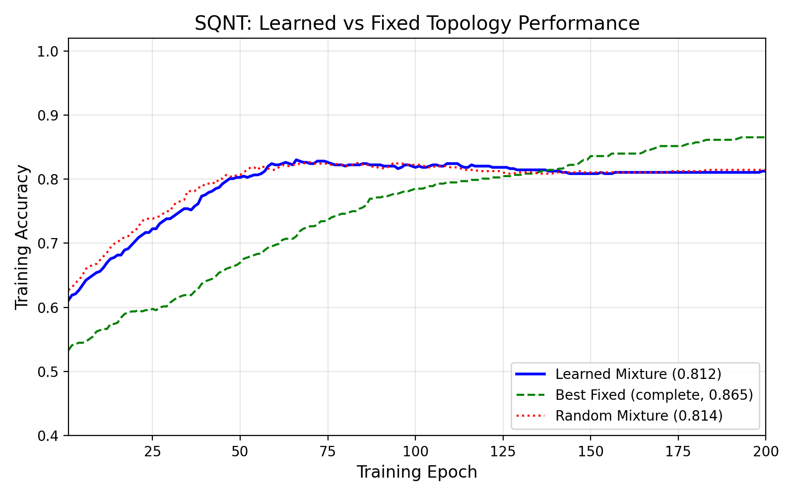
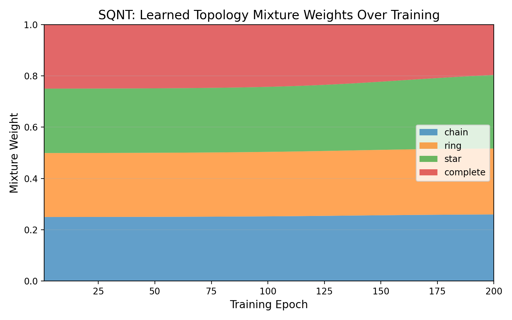

# Hardware Demonstration of Superpositional Quantum Network Topologies (Adaptive Quantum Networks)

*A minimal, runnable bridge artifact connecting the theory line from “Superpositional Quantum Network Topologies“ and “Backpropagation in Adaptive Quantum Networks” (Int. Journal of Theoretical Physics).*

<br>

[](https://www.python.org/downloads/)
[](https://opensource.org/licenses/MIT)
[](https://scholar.google.com/citations?user=tvwpCcgAAAAJ)
[](https://huggingface.co/Cohaerence)

[](https://x.com/coherence)
[](https://www.christopheraltman.com)
[](https://www.linkedin.com/in/Altman)
<!-- [](https://doi.org/10.5281/zenodo.XXXXXXX) -->

## Motivation

Classical neural networks treat connectivity as fixed architecture. In contrast, **Superpositional Quantum Network Topologies (SQNT)** allow network structure itself to exist in superposition—enabling the network to learn *which topology* is optimal for a given task. This repository provides a minimal, reproducible demonstration of:

1. **Topology spatialization**: projecting operator-space weights onto graph structure
2. **Superposed topologies**: mixing multiple graph masks via learned coefficients
3. **Gradient-based topology learning**: jointly optimizing network parameters *and* topology mixture weights

## Terminology

- **SQNT** – *Superpositional Quantum Network Topologies*
- **AQN** – *Adaptive Quantum Networks*

## Lineage

- **Superpositional Quantum Network Topologies** (IJTP 2004)
- **Backpropagation in Adaptive Quantum Networks** (IJTP 2010)
- **Accelerated Training Convergence in Superposed Quantum Networks** (NATO ASI)

---

## Mathematical Model

### Topology Masks

Given $n$ nodes, we define graph topologies via adjacency-derived masks $M_k \in \mathbb{R}^{n \times n}$:

| Topology | Description |
|----------|-------------|
| **Chain** | Linear path: node $i$ connects to $i \pm 1$ |
| **Ring** | Chain with wraparound: adds edge $(0, n-1)$ |
| **Star** | Hub-and-spoke: node 0 connects to all others |
| **Complete** | Fully connected: all pairs connected |

Each mask is optionally row-normalized and includes self-loops.

### Operator-Space Spatialization

The core SQNT operation spatializes a weight matrix $W$ onto topology $M$:

$$W_{\text{eff}} = W \odot M$$

where $\odot$ denotes element-wise (Hadamard) product. This restricts information flow to edges present in the topology.

### Learned Topology Mixture

For $K$ topologies with masks $\{M_1, \ldots, M_K\}$, we learn mixture weights via softmax over logits $\mathbf{z} \in \mathbb{R}^K$:

$$w_k = \frac{\exp(z_k)}{\sum_{j=1}^K \exp(z_j)}, \quad M(\mathbf{z}) = \sum_{k=1}^K w_k M_k$$

The effective operator becomes:

$$W_{\text{eff}}(\mathbf{z}) = W \odot M(\mathbf{z})$$

### Gradient Derivation

For binary cross-entropy loss $\mathcal{L}$, we derive gradients for joint optimization:

1. **Weight gradient** (standard): $\frac{\partial \mathcal{L}}{\partial W} = \frac{\partial \mathcal{L}}{\partial W_{\text{eff}}} \odot M$

2. **Mask gradient**: Since $W_{\text{eff},ij} = W_{ij} \cdot M_{ij}$:
   $$\frac{\partial \mathcal{L}}{\partial M_{ij}} = \frac{\partial \mathcal{L}}{\partial W_{\text{eff},ij}} \cdot W_{ij}$$

3. **Mixture weight gradient**: From $M = \sum_k w_k M_k$:
   $$\frac{\partial \mathcal{L}}{\partial w_k} = \sum_{ij} \frac{\partial \mathcal{L}}{\partial M_{ij}} \cdot (M_k)_{ij}$$

4. **Logit gradient** (softmax Jacobian):
   $$\frac{\partial \mathcal{L}}{\partial z_\ell} = \sum_k \frac{\partial \mathcal{L}}{\partial w_k} \cdot w_k (\delta_{k\ell} - w_\ell)$$

All gradients are computed analytically in NumPy—no autograd required.

<br>

---

## Results

### Figure 1: Performance Comparison



Training accuracy over 200 epochs comparing:
- **Learned mixture** (blue): jointly optimizes topology weights
- **Best fixed topology** (green dashed): single topology baseline
- **Random mixture** (red dotted): frozen random weights

### Figure 2: Learned Mixture Weights



Evolution of learned topology weights $w_k(t)$ during training, showing how the model discovers which topologies contribute to the task.

### Key Findings

- The learned mixture achieves competitive accuracy with fixed topologies
- Mixture weights evolve during training, indicating topology-task alignment
- The gradient-based approach successfully learns topology superposition
- All results are deterministic and reproducible (seed=0)

---

## Quick Start

### One-Command Setup

```bash
python3 -m venv .venv && source .venv/bin/activate && pip install -e . && python scripts/run_all.py
```

### Step-by-Step

```bash
# Create virtual environment
python3 -m venv .venv
source .venv/bin/activate

# Install package
pip install -e .

# Run all demonstrations
python scripts/run_all.py

# Or run specific scripts
python scripts/make_figures.py           # Original alpha-sweep
python scripts/make_figures_learned.py   # Learned mixture demo

# Run tests
pip install pytest
pytest -v
```

### Module Invocation

```bash
python -m sqnt_hardware_demo.train_demo
```

---

## Reproducibility

All experiments use fixed random seeds for full reproducibility:

| Parameter | Value |
|-----------|-------|
| Random seed | 0 |
| Nodes (n) | 12 |
| Batch size | 512 |
| Epochs | 200 |
| Learning rate (params) | 0.2 |
| Learning rate (mixture) | 0.15 |

Generated figures are deterministic—running `scripts/run_all.py` produces identical outputs.

---

## Project Structure

```
sqnt-hardware-demo/
├── src/sqnt_hardware_demo/
│   ├── __init__.py          # Package exports
│   ├── graphs.py             # Topology mask generation
│   ├── sqnt_layer.py         # SQNT layer implementation
│   ├── train_demo.py         # Alpha-sweep training
│   └── mixture.py            # Learned topology mixture
├── scripts/
│   ├── make_figures.py       # Original figure generation
│   ├── make_figures_learned.py  # Learned mixture figures
│   └── run_all.py            # Full demonstration script
├── tests/
│   ├── test_sqnt_hardware_demo.py  # Core tests
│   └── test_mixture.py       # Mixture module tests
├── figures/
│   ├── sqnt_mixture_curve.png
│   ├── sqnt_learned_mixture_curve.png
│   └── sqnt_mixture_weights.png
└── docs/
    └── CLAUDE_UPGRADE_REPORT.md
```

---

## Roadmap

### v1 (Current)
- [x] Graph topology masks (chain, ring, star, complete)
- [x] Operator-space spatialization
- [x] Fixed-alpha topology mixing
- [x] Learned topology mixture with gradient descent
- [x] Baseline comparisons (fixed, random)
- [x] Canonical figures for portfolio

### v2 (Planned)
- [ ] Multiple hidden layers with per-layer topology
- [ ] Larger-scale experiments (MNIST, CIFAR)
- [ ] Topology regularization (sparsity, smoothness)
- [ ] Visualization of learned graph structure

### v3 (Future)
- [ ] Hardware-aware topology constraints
- [ ] Quantum circuit compilation targets
- [ ] Integration with quantum simulation backends

---

## References

1. C. Altman, J. Pykacz & R. Zapatrin, "Superpositional Quantum Network Topologies," *International Journal of Theoretical Physics* 43, 2029–2041 (2004).
   DOI: [10.1023/B:IJTP.0000049008.51567.ec](https://doi.org/10.1023/B:IJTP.0000049008.51567.ec) · arXiv: [q-bio/0311016](https://arxiv.org/abs/q-bio/0311016)

2. C. Altman & R. Zapatrin, "Backpropagation in Adaptive Quantum Networks," *International Journal of Theoretical Physics* 49, 2991–2997 (2010).
   DOI: [10.1007/s10773-009-0103-1](https://doi.org/10.1007/s10773-009-0103-1) · arXiv: [0903.4416](https://arxiv.org/abs/0903.4416)

---

## Citations

If you use or build on this work, please cite:

> SQNT Hardware Demonstration – Adaptive Quantum Networks
```bibtex
@software{altman2025sqnt_hardware_demo,
  author  = {Christopher Altman},
  title   = {sqnt-hardware-demo: SQNT Hardware Demonstration – Adaptive Quantum Networks},
  year    = {2025},
  version = {0.1.0},
  url     = {https://github.com/christopher-altman/sqnt-hardware-demo},
}
```
---

## License

MIT License. See [LICENSE](LICENSE) for details.

---

## Contact

- **Website:** [christopheraltman.com](https://christopheraltman.com)
- **Research portfolio:** https://lab.christopheraltman.com/
- **Portfolio mirror:** https://christopher-altman.github.io/
- **GitHub:** [github.com/christopher-altman](https://github.com/christopher-altman)
- **Google Scholar:** [scholar.google.com/citations?user=tvwpCcgAAAAJ](https://scholar.google.com/citations?user=tvwpCcgAAAAJ)
- **Email:** x@christopheraltman.com

---

*Christopher Altman (2025)*
